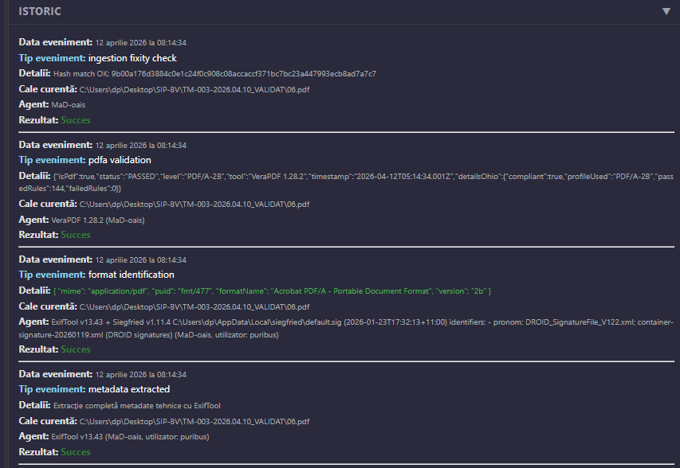
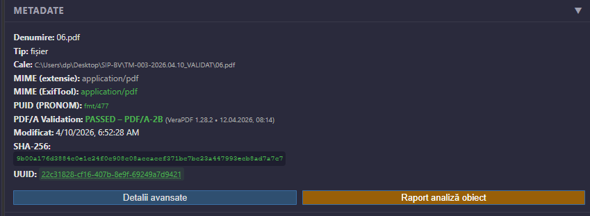
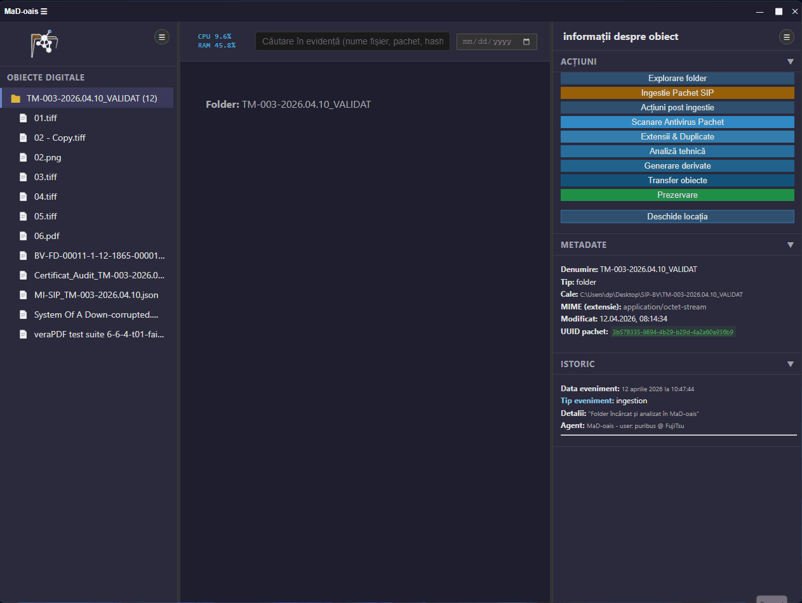
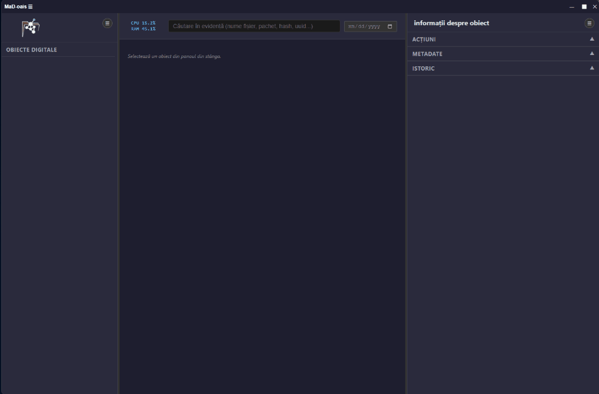
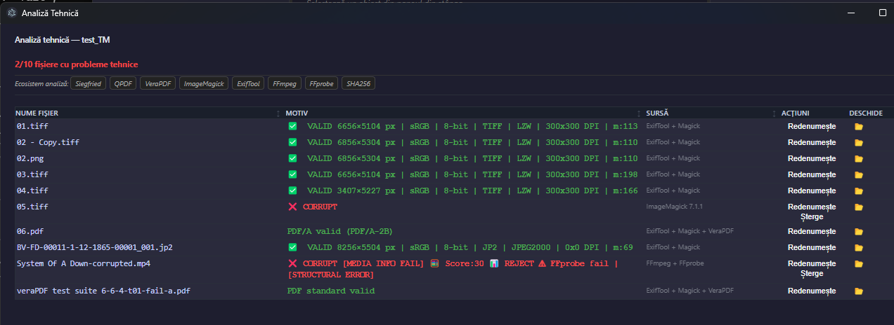

# MaD-oais (Managementul Arhivei Digitale)

Sistem de ingestie, analiză tehnică, creare de derivate și prezervare digitală conform standardelor **OAIS** și **PREMIS**.

**MaD-oais** este o aplicație desktop dezvoltată în Electron, destinată managementului arhivei digitale. Aplicația automatizează fluxul de lucru de la ingestia SIP până la validarea tehnică, generarea derivatelor și managementul metadatelor de prezervare. Sistemul este proiectat pentru a asigura **integritatea**, **trasabilitatea** și **auditabilitatea** completă a arhivei digitale.
---
Dezvoltarea aplicației a fost realizată în colaborare cu **Bogdan Florin Popovici** ([pagina personală](https://bogdanpopovici2008.wordpress.com/)), care a contribuit cu expertiza sa arhivistică și a fundamentat structura conceptuală a fluxului.
---

## Interfață

### Prezentarea interfaței

---
## Funcționalități principale

### Ingestie SIP automată  
Procesarea arhivelor ZIP, extragerea conținutului și validarea manifestelor, intern și extern.

**Documente asociate:**
- [Certificat Audit TM-003 (2026.04.10)](https://danpura.github.io/MaD-oais/Certificat_Audit_TM-003-2026.04.10.html)
- [Raport obiect 05](https://danpura.github.io/MaD-oais/Raport_obiect_05.html)

---

### Vizualizări suplimentare

**Istoric evenimente PREMIS**  
Jurnalul complet al evenimentelor generate în timpul ingestiei: verificări de integritate (fixity), validare PDF/A, identificare de format PRONOM, extragere metadate tehnice și rezultatele fiecărui pas. Reprezintă lanțul de custodie tehnic al obiectului digital.  

**Metadate tehnice extrase**  
Rezumatul metadatelor tehnice pentru obiectul digital: MIME, PUID, nivel PDF/A, hash SHA‑256, data modificării, UUID și alte informații relevante pentru prezervare și audit.  

---
### Scanare antivirus, deduplicare și corecție extensii  
Analiza automată a fișierelor pentru identificarea amenințărilor, detectarea și eliminarea dubletelor, precum și corectarea extensiilor incorecte pe baza identificării reale de format.

**Funcționalități incluse:**

- **Scanare antivirus**  
  Integrare cu motor antivirus local pentru verificarea fiecărui fișier din SIP înainte de procesare.

- **Identificarea și ștergerea dubletelor**  
  Detectarea automată a fișierelor duplicate pe baza hash‑urilor criptografice și eliminarea lor controlată.

- **Identificarea extensiilor incorecte**  
  Compararea extensiei declarate cu formatul real (PRONOM, MIME).

- **Corecția extensiilor**  
  Corecția extensiei fișierului pentru a reflecta formatul identificat corect.

---

### Analiză tehnică  
Evaluarea automată a fișierelor din SIP folosind un ecosistem de instrumente specializate pentru identificare, validare, verificare structurală și extragere de metadate. Modulul detectează fișiere corupte, incompatibile sau cu probleme tehnice și oferă acțiuni rapide pentru corectarea lor.

**Ecosistemul de analiză utilizat:**
- **Siegfried (PRONOM)** – identificare de format și PUID  
- **ExifTool** – extragere metadate tehnice  
- **ImageMagick** – validare imagini (TIFF, PNG, JP2)  
- **QPDF** – verificări structurale PDF  
- **VeraPDF** – validare PDF/A conform standardului ISO  
- **FFmpeg + FFprobe** – analiză fișiere audio-video și detectarea erorilor structurale  
- **SHA-256** – verificare integritate și comparare hash-uri  

**Funcționalități principale:**
- **Identificarea problemelor tehnice** (corupție, incompatibilitate, erori structurale)  
- **Validarea formatelor** conform standardelor (TIFF, JP2, PDF/A etc.)  
- **Afișarea motivului exact al erorii** pentru fiecare fișier  
- **Redenumire asistată** pe baza metadatelor reale (nume corect, extensie corectă, tip de obiect)  
- **Acțiuni rapide**: redenumire, deschidere fișier, ștergere fișiere invalide  

---

### Vizualizare exemplu

**Tabel analiză tehnică**  
Exemplu de listare a fișierelor analizate, cu validări, erori detectate și acțiuni disponibile.  

---

- **Managementul derivatelor**  
  Generarea de copii de acces (preview-uri) și menținerea relațiilor Master → Derivat.

- **Jurnalizare PREMIS**  
  Înregistrarea automată a evenimentelor de prezervare (ingestion, validation, fixity check, deletion, derivation, migration, transfer) în baza de date.

---

## Stiva tehnologică

- **Framework:** Electron.js  
- **Bază de date:** Better-SQLite3 (performanță ridicată, tranzacții atomice)  
- **Unelte externe integrate:**  
  - Siegfried (PRONOM) – identificare formate  
  - ExifTool – extragere metadate  
  - VeraPDF – validare PDF/A  
  - ImageMagick & FFmpeg / FFprobe – procesare multimedia  
  - QPDF – analiză și reparare structuri PDF  
  - Ghostscript - 

---
________________________________________
Structura bazei de date
Sistemul utilizează o schemă relațională orientată spre conformitatea OAIS și PREMIS:
•	sips – evidența pachetelor de intrare
•	digital_objects – metadate pentru fiecare fișier (UUID, PUID, hash, dimensiune)
•	premis_events – jurnalul complet al acțiunilor de prezervare
•	object_relations – relații Master → Derivat și structuri ierarhice
________________________________________
Arhitectura de prezervare (OAIS)
MaD-oais este construit pe modelul de referință ISO 14721 (OAIS) și implementează fluxurile standard de ingestie și prezervare.

---

Status documentație
Documentația este în curs de extindere. Vor fi adăugate:
•	diagrame arhitecturale;
•	exemple de ingestie completă SIP → AIP;
•	mecanisme de audit și verificare fixity;
•	capturi de ecran și fluxuri vizuale.

---

