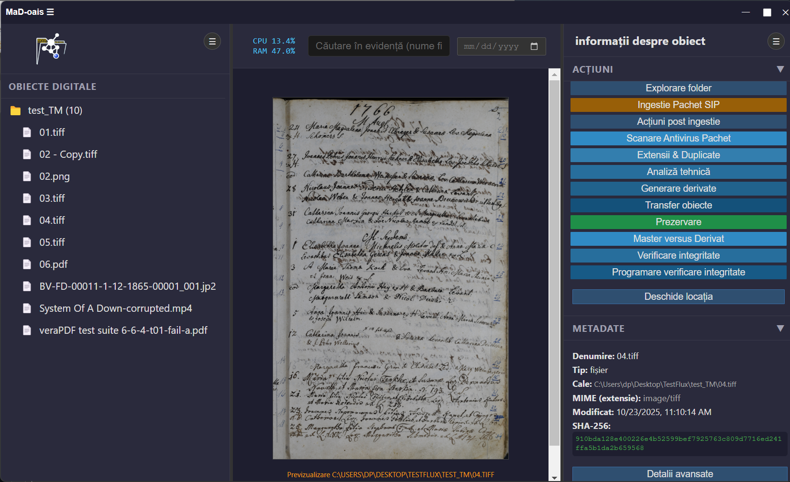
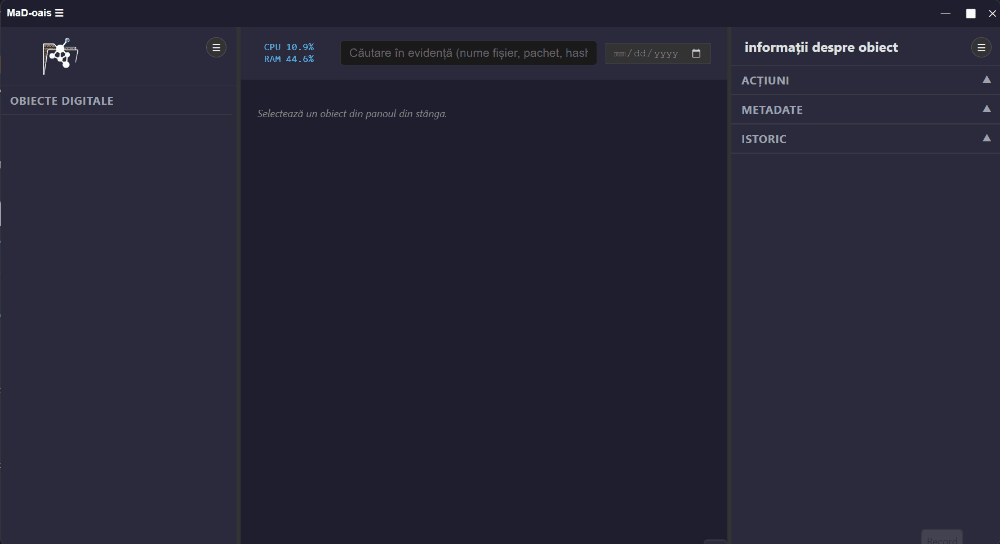
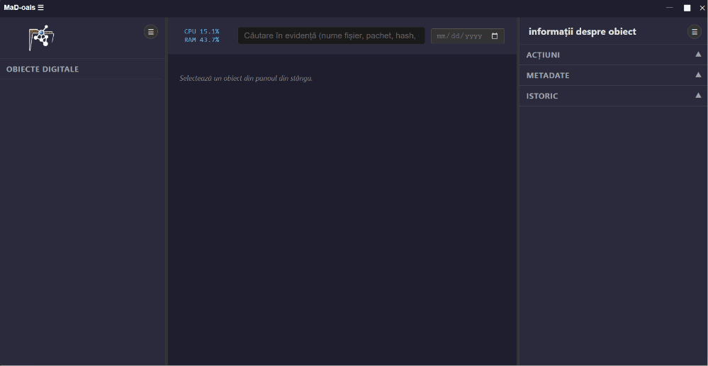

# MaD-oais (Managementul Arhivei Digitale)

Sistem de ingestie, analiză tehnică, creare de derivate și prezervare digitală conform standardelor **OAIS** și **PREMIS**.

**MaD-oais** este o aplicație desktop dezvoltată în Electron, destinată managementului arhivei digitale. Aplicația automatizează fluxul de lucru de la ingestia SIP până la validarea tehnică, generarea derivatelor și managementul metadatelor de prezervare. Sistemul este proiectat pentru a asigura **integritatea**, **trasabilitatea** și **auditabilitatea** completă a arhivei digitale.
---
Dezvoltarea aplicației a fost realizată în colaborare cu **Bogdan Florin Popovici** ([pagina personală](https://bogdanpopovici2008.wordpress.com/)), care a contribuit cu expertiza sa arhivistică și a fundamentat structura conceptuală a fluxului.
---

## Interfață

### Prezentarea interfaței

---
## Funcționalități principale

- **Ingestie SIP automată**  
  Procesarea arhivelor ZIP, extragerea conținutului și validarea manifestelor, intern și extern.

  **Documente asociate:**
 - [Certificat Audit TM-003 (2026.04.10)](https://danpura.github.io/mad-oais-prezentare/Certificat_Audit_TM-003-2026.04.10.html)
- [Raport obiect 05](https://danpura.github.io/mad-oais-prezentare/Raport_obiect_05.html)

- **Securitate**  
  Scanare antivirus integrată pentru pachetele SIP.

- **Analiză tehnică**  
  Identificarea formatelor prin Siegfried (PRONOM), extragerea metadatelor prin ExifTool, validarea PDF/A prin VeraPDF.

- **Integritate garantată**  
  Calcularea și verificarea automată a sumelor de control SHA 256 pentru fiecare obiect digital.

- **Managementul derivatelor**  
  Generarea de copii de acces (preview-uri) și menținerea relațiilor Master → Derivat.

- **Jurnalizare PREMIS**  
  Înregistrarea automată a evenimentelor de prezervare (ingestion, validation, fixity check, deletion, derivation, migration, transfer) în baza de date.

---

## Stiva tehnologică

- **Framework:** Electron.js  
- **Bază de date:** Better-SQLite3 (performanță ridicată, tranzacții atomice)  
- **Unelte externe integrate:**  
  - Siegfried (PRONOM) – identificare formate  
  - ExifTool – extragere metadate  
  - VeraPDF – validare PDF/A  
  - ImageMagick & FFmpeg / FFprobe – procesare multimedia  
  - QPDF – analiză și reparare structuri PDF  
  - Ghostscript - 

---
________________________________________
Structura bazei de date
Sistemul utilizează o schemă relațională orientată spre conformitatea OAIS și PREMIS:
•	sips – evidența pachetelor de intrare
•	digital_objects – metadate pentru fiecare fișier (UUID, PUID, hash, dimensiune)
•	premis_events – jurnalul complet al acțiunilor de prezervare
•	object_relations – relații Master → Derivat și structuri ierarhice
________________________________________
Arhitectura de prezervare (OAIS)
MaD-oais este construit pe modelul de referință ISO 14721 (OAIS) și implementează fluxurile standard de ingestie și prezervare.

---

Status documentație
Documentația este în curs de extindere. Vor fi adăugate:
•	diagrame arhitecturale;
•	exemple de ingestie completă SIP → AIP;
•	mecanisme de audit și verificare fixity;
•	capturi de ecran și fluxuri vizuale.

---

